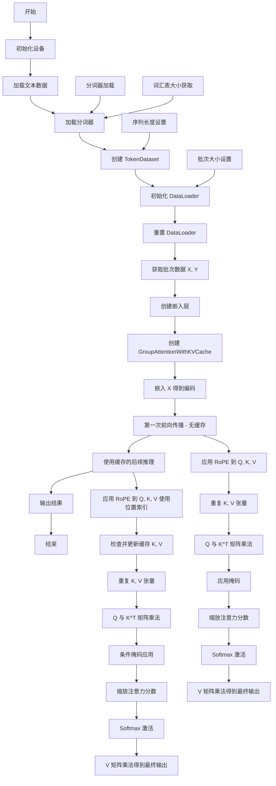

# Rust-Candle 数据处理流程文档

## 概述

本项目实现了基于 Rust 和 Candle 框架的深度学习模型，主要包含 Transformer 架构中的注意力机制实现，特别是分组注意力（Group Attention）和 KV 缓存机制。

## 数据处理流程图

## 详细流程说明

### 1. 初始化阶段
- **设备初始化**: 使用 Metal（如果可用）或 CPU 作为计算设备
- **数据加载**: 从指定路径加载文本数据和分词器
- **参数设置**: 设置序列长度、步长、批次大小等超参数

### 2. 数据预处理
- **TokenDataset 创建**: 将文本数据转换为 token ID 序列，按指定序列长度和步长进行切分
- **DataLoader 初始化**: 用于按批次加载数据，支持数据打乱

### 3. 模型组件构建
- **嵌入层**: 将 token ID 转换为向量表示
- **GroupAttentionWithKVCache**: 实现分组注意力机制，支持 KV 缓存以提高推理效率
- **RoPE (Rotary Position Embedding)**: 旋转位置编码，为序列中的位置提供信息

### 4. 前向传播过程

#### 4.1 无缓存前向传播
1. **嵌入**: 将输入 token 转换为嵌入向量
2. **线性变换**: 通过 Q、K、V 线性层得到查询、键、值矩阵
3. **张量重塑**: 调整张量形状以适应多头注意力
4. **RoPE 应用**: 对 Q、K、V 应用旋转位置编码
5. **张量重复**: 对 K、V 进行分组重复以匹配多头结构
6. **注意力计算**: Q 与 K^T 矩阵乘法得到注意力分数
7. **掩码应用**: 应用下三角掩码实现因果注意力
8. **缩放与 Softmax**: 缩放注意力分数并应用 Softmax
9. **输出计算**: 与 V 矩阵相乘得到最终输出

#### 4.2 带缓存前向传播
1. **RoPE 应用**: 使用位置索引应用 RoPE
2. **缓存管理**: 检查是否存在缓存，若无则创建，若有则连接
3. **其余步骤**: 与无缓存版本相同

## 核心组件说明

### TokenDataset
- 将文本数据转换为模型可用的 token ID 格式
- 支持滑动窗口切分以生成训练序列

### GroupAttentionWithKVCache
- 实现分组注意力机制，减少计算复杂度
- 支持 KV 缓存以加速自回归生成
- 通过重复机制实现多查询注意力

### RoPE (Rotary Position Embedding)
- 为模型提供位置信息
- 通过旋转矩阵编码位置关系
- 支持完整序列处理和增量位置处理

## 数据流向

输入数据 → 分词 → Token ID → 嵌入层 → 线性变换 → 多头重塑 → RoPE → 注意力计算 → 输出

## 关键参数
- `seq_len`: 序列长度 (32)
- `batch_size`: 批次大小 (2)
- `embedding_dim`: 嵌入维度 (32)
- `n_head`: 注意力头数 (4)
- `n_kv_head`: KV 头数 (2)
- `head_dim`: 每头维度 (8)

## 特色功能
1. **KV 缓存**: 提高自回归生成效率
2. **分组注意力**: 平衡模型性能和计算效率
3. **RoPE**: 有效的位置编码机制
4. **Metal 支持**: 利用 Apple Silicon 的硬件加速